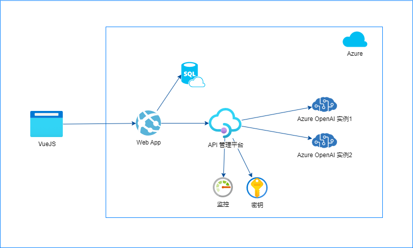

# 利用 APIM 管理多个 Azure OpenAI 资源的endpoint/key

当您拿到Azure OpenAI的订阅时，创建完服务，可以使用这个项目来部署第一个应用，分享给同事或朋友一起探索。<br/>

- 前端使用 Vue 3 + TypeScript + Vite 实现。移动设备显示可自适应。
- 后端使用 express JS API 来调用 Azure API 管理平台，再到 Azure OpenAI 的endpoint。AOAI的key不会提供给前端。
- 聊天记录不会在后端保存，但可以使用APIM的日志管理和审计特性来管理。
- 支持 GPT-3.5 和 GPT-4 的流式API显示。
- 支持定义多种参数的多个聊天app，不同的app不同的url，可以分发给不同的人。也方便对比不同参数的效果。
- 可以通过APIM的Policy实现多AOAI后端的负载均衡，提高rate limit。部署完后，参考后面负载均衡的部份。

部署的架构参考:



## 部署步骤
### 创建Azure资源
- 下载安装Power Shell 7，使用 `$PSVersionTable.PSVersion` 检查版本
- 下载安装sqlcmd, 用于初始化数据库。**安装完请重新打开PowerShell命令窗口。**
> 如果安装sqlcmd出现问题，检查是否已安装Microsoft ODBC Driver 17 for SQL Server
> 
> https://learn.microsoft.com/zh-cn/sql/tools/sqlcmd/sqlcmd-utility?view=sql-server-ver16
- 在Azure OpenAI中创建多个部署（这里以两个为例），获取相应的部署ID，模型ID和Key
>   
- 打开[./script/deploy.ps1](./script/deploy.ps1), 按提示修改如下变量:

```bash
$RESOURCE_GROUP_NAME="TestGroupAPIM"
$LOCATION="eastasia"

# for DB
$SQL_SERVER_NAME="<UniqueSQLServerName>"                      # 需全球唯一
$ADMIN_USERNAME="SQLAdmin"
$ADMIN_PASSWORD=Read-Host "Enter the admin password"          # 命令行中输入，密码不能太简单
$DB_NAME="dbGPT"

#for APIM
$SVC_NAME="<UniqueAPIMName>"                                  # 需全球唯一
$API_ID="azuregpt-api"
$AOAI_DEPLOYMENT_ID="<your OpenAI resource name>"
$AOAI_MODEL_ID="<your deployment id>"
$AOAI_KEY=$AOAI_KEY = Read-Host "Enter the Azure OpenAI key"

# 服务创建完成会发邮件通知
$APIM_PUBLISHER_EMAIL="<your email>"
$PUBLISHER="<your publisher name>"

#for Web App
$VUE_APP_APIM_HOST=$SVC_NAME + ".azure-api.net"
$VUE_APP_APIM_KEY="xxx"                                       # 等待API服务创建完成手动在Portal填写
$APP_NAME="MyChatBot$(Get-Date -Format 'MMddHHmmss')"         # 需全球唯一
$DOCKER_IMAGE="radezheng/tsgpt:basic"                         # 可不改/改为自己的镜像地址
```

- 打开powershell, 运行 script\deploy.ps1。创建APIM需要大概20分钟到半小时。收到邮件后再继续下面的步骤.
```powershell
cd script
.\deploy.ps1
```
### 运行 deploy.ps1 常见问题排错
#### 1. The term 'az' is not recognized as the name of a cmdlet, function, script file, or operable program.
这个错误是因为 PowerShell 无法找到 "az" 命令，请按照以下步骤安装和配置 Azure CLI：  
   
1. 访问 https://aka.ms/installazurecliwindows 下载安装包并运行。  
2. 打开 PowerShell 输入 ```az login``` 以登录到 Azure。
3. 再次运行 `deploy.ps1` 脚本，应该就可以正常使用 "az" 命令了。  
4. 如果已经安装了 Azure CLI 但仍然收到这个错误，可以尝试手动添加 Azure CLI 的安装路径到系统的 PATH 环境变量中。

#### 2. The file is not digitally signed. You cannot run this script on the current system.
这个错误是因为 Windows 要求所有的 PowerShell 脚本必须经过数字签名才能在当前系统上运行。你可以通过运行以下命令来解决该问题：

1. 更改 PowerShell 当前会话的执行策略，允许运行未经数字签名的脚本。
```
Set-ExecutionPolicy -Scope Process -ExecutionPolicy Bypass
```  
2. 重新运行 deploy.ps1 脚本，应该就可以正常执行了。
3. 完成操作后，为安全性考虑，将执行策略更改回默认值，即禁止运行任何 PowerShell 脚本。
```
Set-ExecutionPolicy -Scope Process -ExecutionPolicy Restricted
``` 

#### 3. Code: AuthorizationFailed
这个错误是因为你使用的 Azure 帐户没有足够的权限来创建资源。你可以使用以下步骤解决这个问题：
1. 登录到Azure账户
```
az login  
```
2. 检查当前选择的是不是你要使用的订阅
```
az account show
```  
3. 切换到正确订阅，其中 "Subscription Name" 是你要切换到的订阅名称（可在Azure Portal中查看）。
```
az account set --subscription "Subscription Name"
```

### 部署多个Azure OpenAI的Endpoint/key
- 在Azure APIM 创建多个backend：**URL格式必须一样。** 并设定api-key的header, key设定为OpenAI key.
```bash
# 替换为相应backend的值 
https://<your OpenAI resource name>.openai.azure.com/openai/deployments/<your deployment id>  
```

- 打开API Post 接口的Policy:

- 将内容全部复制替换 为 ./apim/loadbanlance.xml

如果有多个backend, 修改 "2" 为相应的数量，并按条件增加路由项。
## [可选] API的监控与审计


## 如果本地开发调试
- 按前面部署好Azure服务准备
- 复制 env.example到 .env, 并设定相关变量值
- 然后运行
```bash
npm install


#启动 express API server
npm run start:server

#另一窗口，启动前端
npm run dev
```
按提示访问前端即可

--- 


